# CAPYHELP - AI Helpdesk Platform 🎧

<p align="center">
  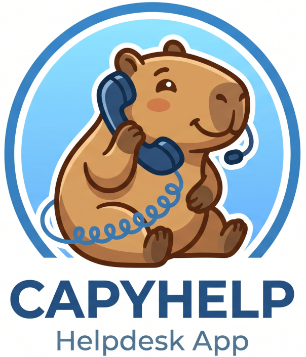
</p>

<p align="center">
  
  
  
  
  
  
  
</p>

**CAPYHELP** is a Docker-first helpdesk application for managing customer tickets, support staff, real-time conversations, notifications, PDF reports, and AI-assisted replies.

The project was built as a full-stack support system using Laravel, Inertia, Vue, Tailwind CSS, Laravel Reverb, MySQL, Mailpit, ClamAV, and Ollama. It is designed to run locally with Docker Compose and provide a realistic helpdesk workflow out of the box.

## 📚 Table of Contents

- [Features](#features)
- [Technology Stack](#technology-stack)
- [Screenshots](#screenshots)
- [Architecture](#architecture)
- [Quick Start](#quick-start)
- [Default Accounts](#default-accounts)
- [Docker Services](#docker-services)
- [Ollama AI](#ollama-ai)
- [AMD GPU Mode](#amd-gpu-mode)
- [ClamAV Antivirus](#clamav-antivirus)
- [Mailpit Email Testing](#mailpit-email-testing)
- [Localization](#localization)
- [Testing](#testing)
- [Useful Commands](#useful-commands)
- [Project Structure](#project-structure)
- [What I Learned](#what-i-learned)
- [Future Improvements](#future-improvements)

<a id="features"></a>

## ✨ Features

- **Ticket dashboard** with filters, status counters, assignment, priority, channel, and pagination.
- **Customer ticket form** available without an account at `/support`.
- **Private customer ticket link** so customers can continue the conversation without registering.
- **Real-time ticket chat** powered by Laravel Reverb, Laravel Echo, and Vue.
- **Staff-to-staff private chat** with a Messenger-style contact list.
- **Rich message composer** with bold, italic, underline, emoji picker, and file attachments.
- **Attachment previews** in the chat and media/files panels.
- **ClamAV upload scanning** for customer and internal attachments.
- **In-app notifications** with a bell dropdown and read/unread state.
- **Email notifications** through Mailpit in development.
- **Notification preferences** per user.
- **SLA warnings** generated by scheduled commands.
- **Weekly team reports** sent by scheduler.
- **PDF ticket reports** generated with DOMPDF.
- **Admin user management** with create, update, delete, roles, and account-change notifications.
- **Agent-safe team directory** where non-admin agents can view staff data without editing accounts.
- **Knowledge base** with problem symptoms, solution steps, tags, and ready customer replies.
- **AI tone rewrite** for support replies using local Ollama models.
- **AI ticket summary** for closed or resolved tickets.
- **Multi-language interface**: English, Polish, Chinese, French, German, Italian, and Russian.
- **Light and dark themes** stored in user settings.
- **Mobile-friendly UI** for the main support workflows.

<a id="technology-stack"></a>

## 🛠️ Technology Stack

### ⚙️ Backend

- PHP 8.3
- Laravel 13
- Laravel Reverb
- Laravel Queues and Scheduler
- MySQL 8.4
- DOMPDF through `barryvdh/laravel-dompdf`
- ClamAV integration through a custom `ClamAvScanner` service
- Ollama HTTP API integration for local LLM features

### 🎨 Frontend

- Vue 3
- Inertia.js
- Tailwind CSS 4
- Laravel Echo
- Pusher JS protocol client for Reverb
- Vue I18n
- Vue 3 Emoji Picker
- Font Awesome icons

### 🐳 Infrastructure

- Docker Compose
- Nginx
- PHP-FPM
- MySQL
- Mailpit
- Adminer
- Laravel Reverb WebSocket server
- Queue worker
- Scheduler worker
- Ollama
- ClamAV

<a id="screenshots"></a>

## 📊 Screenshots

### 🔐 Login

<p align="center">
  <a href="docs/screenshots/login.png">
    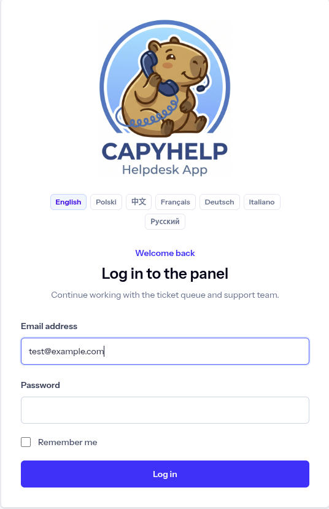
  </a>
</p>

### 🎫 Ticket Dashboard

<p align="center">
  <a href="docs/screenshots/dashboard.png">
    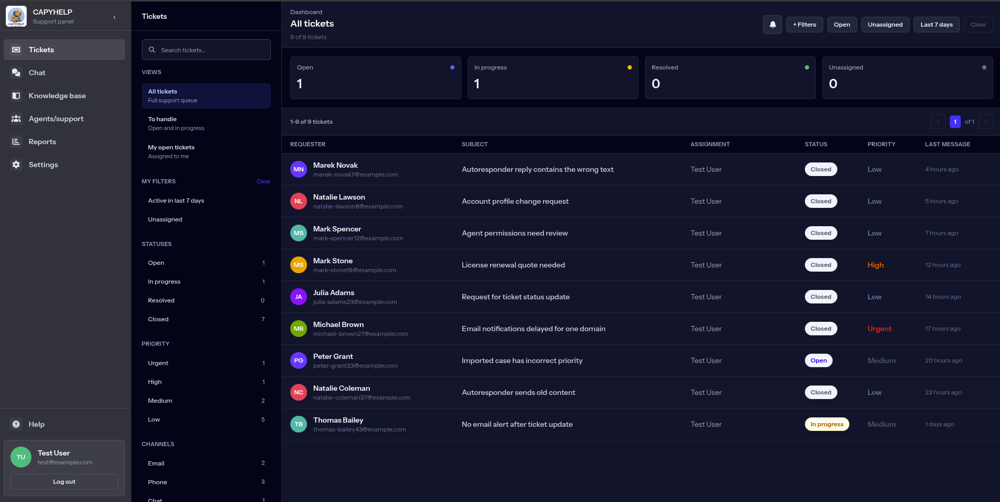
  </a>
</p>

### 💬 Ticket Conversation with AI Summary

<p align="center">
  <a href="docs/screenshots/ticket_chat.png">
    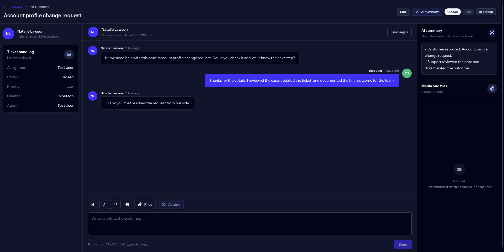
  </a>
</p>

### 📝 Public Customer Ticket Form

<p align="center">
  <a href="docs/screenshots/ticket_form.png">
    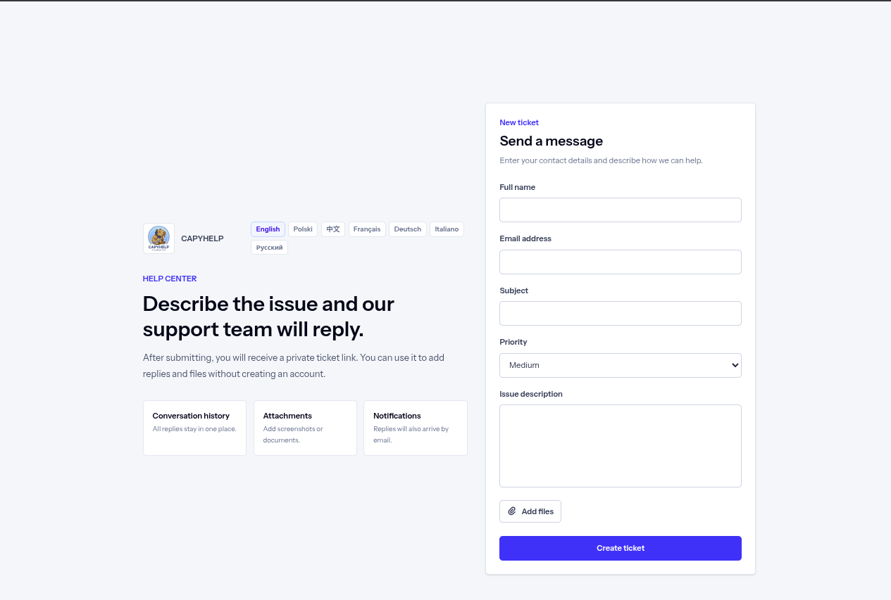
  </a>
</p>

### 📘 Knowledge Base

<p align="center">
  <a href="docs/screenshots/base.png">
    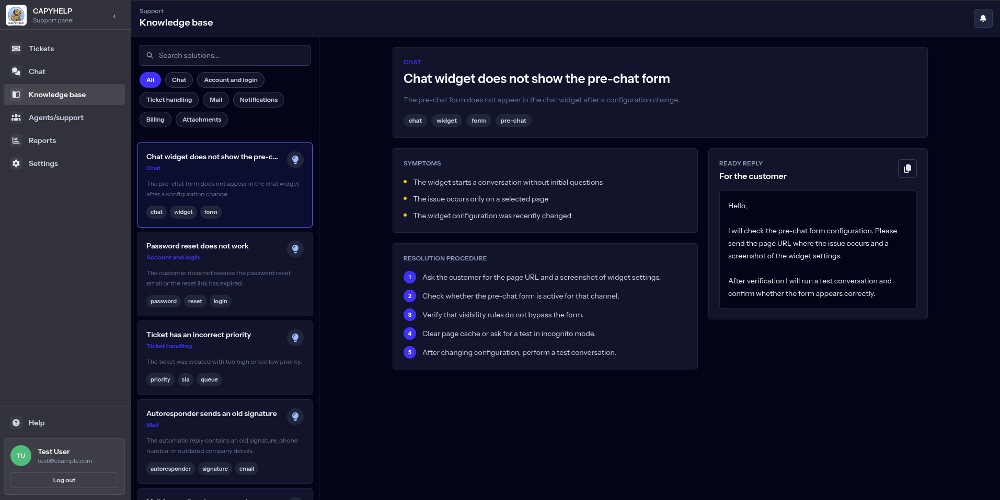
  </a>
</p>

### 🔔 Notifications

<p align="center">
  <a href="docs/screenshots/notifications.png">
    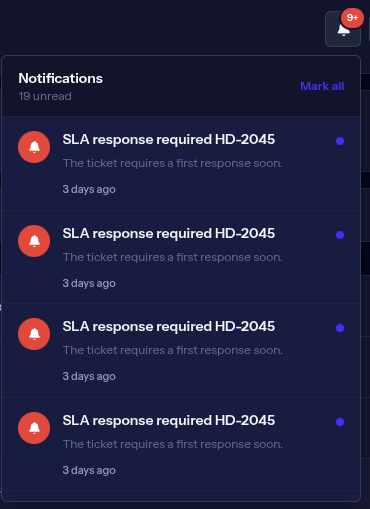
  </a>
</p>

### 📈 Reports

<p align="center">
  <a href="docs/screenshots/reports.png">
    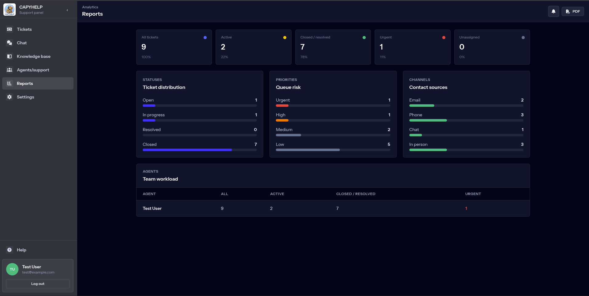
  </a>
</p>

### 📄 PDF Report

<p align="center">
  <a href="docs/screenshots/report_in_pdf.png">
    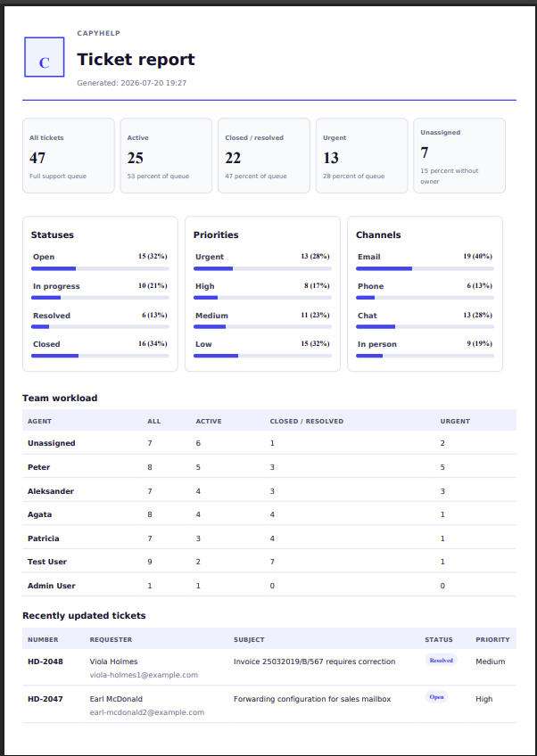
  </a>
</p>

### 👥 Team Directory

<p align="center">
  <a href="docs/screenshots/team.png">
    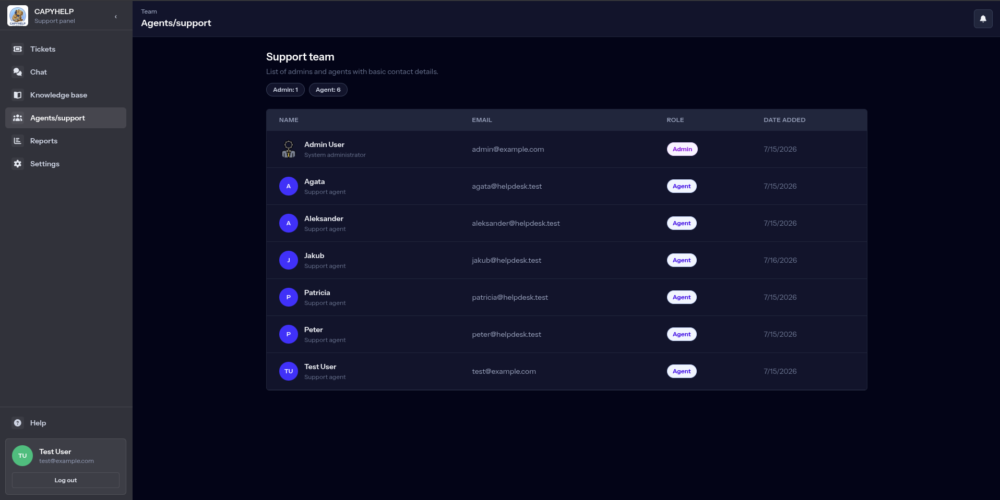
  </a>
</p>

### 🧑‍💼 Admin User Management

<p align="center">
  <a href="docs/screenshots/crud_agents.png">
    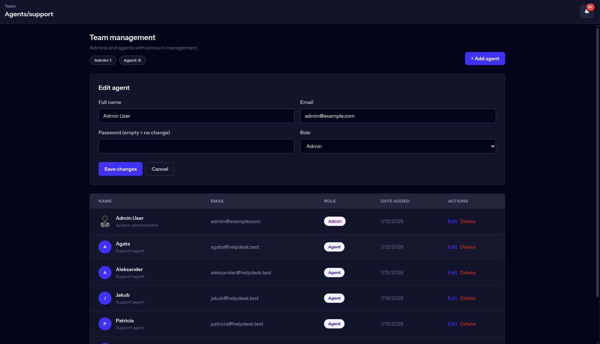
  </a>
</p>

### ⚙️ Admin Settings

<p align="center">
  <a href="docs/screenshots/settings_admin.png">
    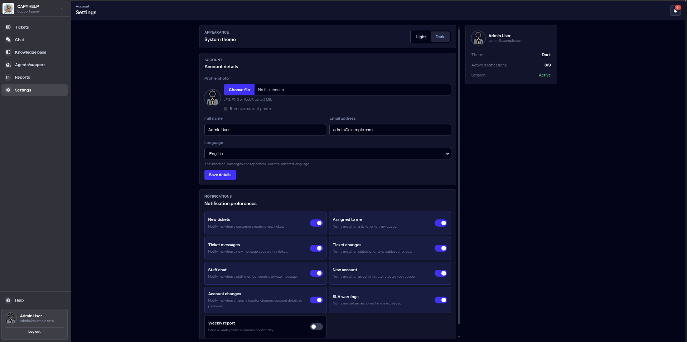
  </a>
</p>

### 🧩 Agent Settings

<p align="center">
  <a href="docs/screenshots/settings_user.png">
    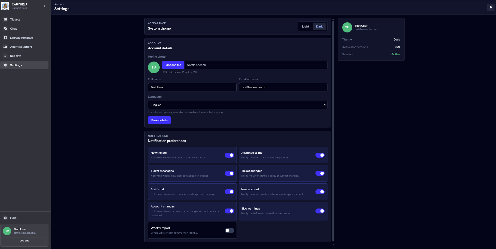
  </a>
</p>

### 🐳 Docker Stack

<p align="center">
  <a href="docs/screenshots/docker.png">
    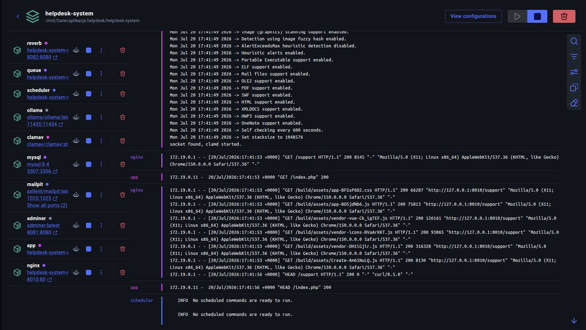
  </a>
</p>

<a id="architecture"></a>

## 🏗️ Architecture

CAPYHELP is split into several focused services:

| Layer | Responsibility |
| --- | --- |
| Laravel app | Authentication, authorization, ticket logic, notifications, API endpoints, file handling |
| Inertia + Vue | Reactive UI for tickets, chat, reports, settings, knowledge base, and public support forms |
| Laravel Reverb | WebSocket server for real-time ticket messages, staff chat, and notifications |
| Queue worker | Sends mail notifications and background jobs |
| Scheduler | Runs SLA checks and weekly report delivery |
| MySQL | Stores users, tickets, messages, attachments, notifications, social accounts, and knowledge articles |
| Mailpit | Captures outgoing development emails |
| ClamAV | Scans uploaded attachments before they are accepted |
| Ollama | Runs local LLM models for AI tone rewriting and summaries |
| Nginx | Serves the public application and static assets |

<a id="quick-start"></a>

## 🚀 Quick Start

### ✅ Requirements

- Docker Engine or Docker Desktop
- Docker Compose v2
- Node.js and npm for building frontend assets
- Optional: AMD GPU with ROCm-compatible Docker setup for faster Ollama inference

### 1. Clone the repository

```bash
git clone <repository-url>
cd helpdesk-system
```

### 2. Build frontend assets

The Docker images copy the compiled Vite assets from `public/build`, so build the frontend before starting the containers on a fresh clone.

```bash
npm install
npm run build
```

### 3. Start the full Docker stack

```bash
docker compose up -d --build
```

### 4. Prepare the database

```bash
docker compose exec app php artisan migrate:fresh --seed
```

### 5. Pull the default Ollama model

```bash
docker compose exec ollama ollama pull llama3.2:3b
```

### 6. Open the application

- Application: `http://localhost:8010`
- Public customer form: `http://localhost:8010/support`
- Mailpit: `http://localhost:8025`
- Adminer: `http://localhost:8081`

No external mail server, database server, antivirus server, or LLM API key is required for the local stack.

<a id="default-accounts"></a>

## 🔑 Default Accounts

Seeded accounts use the same password:

```text
password
```

| Role | Email | Description |
| --- | --- | --- |
| Admin | `admin@example.com` | Full ticket, user, report, and settings access |
| Agent | `test@example.com` | Standard support agent |
| Agent | `peter@helpdesk.test` | Demo support agent |
| Agent | `patricia@helpdesk.test` | Demo support agent |
| Agent | `aleksander@helpdesk.test` | Demo support agent |
| Agent | `agata@helpdesk.test` | Demo support agent |

<a id="docker-services"></a>

## 🐳 Docker Services

| Service | URL / Port | Notes |
| --- | --- | --- |
| `nginx` | `http://localhost:8010` | Main web entry point |
| `app` | internal `9000` | Laravel PHP-FPM app |
| `mysql` | `localhost:3307` | MySQL database, internal host `mysql:3306` |
| `adminer` | `http://localhost:8081` | Database UI |
| `mailpit` | `http://localhost:8025`, SMTP `1025` | Local email testing |
| `reverb` | `localhost:8082` | WebSocket server |
| `queue` | internal | Laravel queue listener |
| `scheduler` | internal | Laravel scheduled tasks |
| `ollama` | `http://localhost:11435` | Local LLM API |
| `clamav` | internal `3310` | Antivirus scanner |

Adminer login:

```text
System: MySQL
Server: mysql
Username: root
Password: root
Database: helpdesk
```

<a id="ollama-ai"></a>

## 🤖 Ollama AI

CAPYHELP uses Ollama for two local AI workflows:

1. **AI tone rewrite**
   - Available in the ticket reply composer.
   - Rewrites a drafted message into a clearer, professional support response.
   - The model is instructed to return only the final customer-facing text.

2. **AI summary**
   - Available after a ticket is `resolved` or `closed`.
   - Generates a short internal summary of the case.
   - The summary is stored on the ticket.

Default Docker configuration:

```env
OLLAMA_BASE_URL=http://ollama:11434
OLLAMA_MODEL=llama3.2:3b
OLLAMA_FALLBACK_MODEL=llama3.2:3b
OLLAMA_TIMEOUT=180
OLLAMA_TEMPERATURE=0.0
OLLAMA_TOP_P=0.2
OLLAMA_TOP_K=10
OLLAMA_REPEAT_PENALTY=1.2
OLLAMA_NUM_CTX=2048
OLLAMA_NUM_PREDICT=450
OLLAMA_SEED=42
```

The low temperature, narrow sampling settings, deterministic seed, server-side output cleanup, and fallback model are used to reduce hallucinations. Agents should still review AI output before sending it to a customer.

Useful Ollama commands:

```bash
docker compose exec ollama ollama list
docker compose exec ollama ollama pull llama3.2:3b
docker compose exec ollama ollama run llama3.2:3b
```

<a id="amd-gpu-mode"></a>

## ⚡ AMD GPU Mode

The base `docker-compose.yml` runs Ollama on CPU so the project starts on most machines.

For AMD GPU acceleration, use the override file:

```bash
docker compose -f docker-compose.yml -f docker-compose.amd.yml up -d --build
docker compose exec ollama ollama pull mistral-small:24b
docker compose exec ollama ollama pull llama3.2:3b
```

The AMD override:

- switches Ollama to `ollama/ollama:rocm`
- exposes `/dev/kfd`
- exposes `/dev/dri`
- sets `OLLAMA_MODEL=mistral-small:24b`
- keeps `llama3.2:3b` as a fallback model

Before using the AMD override, verify the devices exist on the host:

```bash
ls -l /dev/kfd /dev/dri
```

If those devices are missing, use the CPU stack or install the required AMD/ROCm drivers.

<a id="clamav-antivirus"></a>

## 🛡️ ClamAV Antivirus

Uploaded files are scanned through ClamAV before they are accepted.

Docker enables ClamAV for the application with:

```env
CLAMAV_ENABLED=true
CLAMAV_HOST=clamav
CLAMAV_PORT=3310
CLAMAV_TIMEOUT=30
```

The scanner sends files through ClamAV's `INSTREAM` protocol. If ClamAV returns `FOUND`, the upload is rejected. If the scanner cannot confirm that a file is clean, the upload is rejected as well.

You can test the antivirus flow with the EICAR test string:

```text
X5O!P%@AP[4\PZX54(P^)7CC)7}$EICAR-STANDARD-ANTIVIRUS-TEST-FILE!$H+H*
```

Save that text as `eicar.txt` and try to upload it as a ticket attachment. The application should reject it.

<a id="mailpit-email-testing"></a>

## 📬 Mailpit Email Testing

All development emails are sent to Mailpit instead of real inboxes.

Open the mailbox UI:

```text
http://localhost:8025
```

The following notifications are delivered through the queue:

- New ticket notification
- Ticket assignment notification
- Ticket message notification
- Internal ticket message notification
- Team chat message notification
- Account created notification
- Account updated notification
- Ticket updated notification
- SLA warning notification
- Weekly report notification
- Customer ticket created notification

<a id="localization"></a>

## 🌍 Localization

The interface supports:

- English
- Polish
- Chinese
- French
- German
- Italian
- Russian

Language can be changed:

- from the login screen
- from account settings
- from the public support form
- from the customer ticket conversation page

Translations are defined in:

```text
resources/js/i18n/messages.js
lang/*/helpdesk.php
config/locales.php
```

The selected language is persisted for authenticated users through the `locale` column on the `users` table.

<a id="testing"></a>

## 🧪 Testing

The feature test suite covers access control, tickets, messages, team chat, customer tickets, PDF reports, scheduled notifications, account settings, social auth, localization, and AI behavior.

Because the production Docker image installs Composer dependencies with `--no-dev`, run tests in a local development install:

```bash
composer install
npm install
php artisan test
```

Selected test files:

```text
tests/Feature/TicketAccessControlTest.php
tests/Feature/TicketMessageTest.php
tests/Feature/CustomerTicketTest.php
tests/Feature/TeamChatTest.php
tests/Feature/UserManagementTest.php
tests/Feature/ReportPdfTest.php
tests/Feature/ScheduledNotificationsTest.php
tests/Feature/SocialAuthTest.php
tests/Feature/LocalizationTest.php
tests/Feature/TicketAiTest.php
```

<a id="useful-commands"></a>

## 💻 Useful Commands

Start the stack:

```bash
docker compose up -d --build
```

Stop the stack:

```bash
docker compose down
```

Reset database and seed demo data:

```bash
docker compose exec app php artisan migrate:fresh --seed
```

Watch logs:

```bash
docker compose logs -f app nginx queue reverb scheduler clamav ollama
```

Rebuild after changing PHP or Vue files:

```bash
npm run build
docker compose up -d --build app nginx queue reverb scheduler
```

Run scheduled tasks manually:

```bash
docker compose exec app php artisan helpdesk:sla-warnings
docker compose exec app php artisan helpdesk:weekly-report
```

Generate Laravel optimized caches for a production-like build:

```bash
docker compose exec app php artisan optimize
```

Clear Laravel caches:

```bash
docker compose exec app php artisan optimize:clear
```

Remove containers and local volumes:

```bash
docker compose down -v
```

Warning: `docker compose down -v` deletes local MySQL, Ollama, ClamAV, and uploaded-file volumes.

<a id="project-structure"></a>

## 🗂️ Project Structure

```text
app/
  Events/                    Real-time broadcast events
  Http/Controllers/           Ticket, auth, chat, reports, users, AI, settings
  Mail/                       Mail notifications
  Models/                     Eloquent models
  Policies/                   Ticket and user authorization
  Services/ClamAvScanner.php  Antivirus scanning service

database/
  migrations/                 Tables for users, tickets, messages, notifications, chat, knowledge base
  seeders/                    Demo users, tickets, knowledge articles

docker/
  nginx/                      Nginx image and config
  php/                        PHP-FPM image

resources/
  js/                         Vue/Inertia frontend
  views/mail/                 Email templates
  views/reports/              PDF report template

routes/
  web.php                     Web, API-like, auth, support, ticket, report routes
  channels.php                Broadcast channel authorization
  console.php                 SLA and weekly report scheduled commands

tests/
  Feature/                    Application feature tests
  Unit/                       Unit tests
```

<a id="main-routes"></a>

## 🧭 Main Routes

| Area | Route |
| --- | --- |
| Login | `/` |
| Tickets | `/tickets` |
| Ticket details | `/tickets/{ticket}` |
| Staff chat | `/team-chat` |
| Knowledge base | `/knowledge-base` |
| Team / agents | `/agents` |
| Reports | `/reports` |
| PDF report | `/reports/tickets.pdf` |
| Settings | `/settings` |
| Public support form | `/support` |
| Customer ticket link | `/support/tickets/{ticket}` |

<a id="data-model-overview"></a>

## 🗄️ Data Model Overview

Main database tables:

- `users`
- `social_accounts`
- `tickets`
- `ticket_messages`
- `ticket_message_attachments`
- `team_chat_messages`
- `team_chat_attachments`
- `user_notifications`
- `knowledge_articles`
- `jobs`
- `cache`
- `sessions`

<a id="production-notes"></a>

## 🚢 Production Notes

Before using the project outside local development:

- Generate a new `APP_KEY`.
- Set `APP_DEBUG=false`.
- Move secrets out of `docker-compose.yml`.
- Use a real SMTP provider instead of Mailpit.
- Use TLS for HTTP and WebSocket traffic.
- Use durable object storage for attachments if needed.
- Review file size limits and retention rules.
- Use queue workers managed by Supervisor or an equivalent process manager.
- Replace local Docker credentials with production-grade secrets.

<a id="what-i-learned"></a>

## 💡 What I Learned

- Building a Laravel + Inertia application as a cohesive SPA-like product without separating backend and frontend repositories.
- Using Laravel Reverb and Echo for real-time conversations and notification updates.
- Designing role-based access for admins and agents with policies and middleware.
- Implementing local email testing with Mailpit.
- Generating PDF reports directly from Laravel views.
- Integrating a local LLM with Ollama while reducing hallucinations through prompt design and deterministic generation settings.
- Adding ClamAV scanning to the upload pipeline.
- Preparing a Docker Compose stack with multiple cooperating services.
- Designing multilingual Vue UI state with persisted user locale.

<a id="future-improvements"></a>

## 🚀 Future Improvements

- Add a CI pipeline for PHP tests, frontend build, and code style checks.
- Move frontend asset compilation into a multi-stage Docker build for a fully Docker-only build.
- Add automated browser tests for mobile layouts and real-time chat flows.
- Add stronger audit logs for admin actions.
- Add rate limiting to the public support form.
- Add RAG-style grounding for AI responses using the knowledge base.
- Add object storage support for attachments.
- Add production deployment manifests.

<a id="license"></a>

## 📄 License

This project is licensed under the **GNU General Public License v3.0 or later**.

See [LICENSE](LICENSE) for the full license text.
